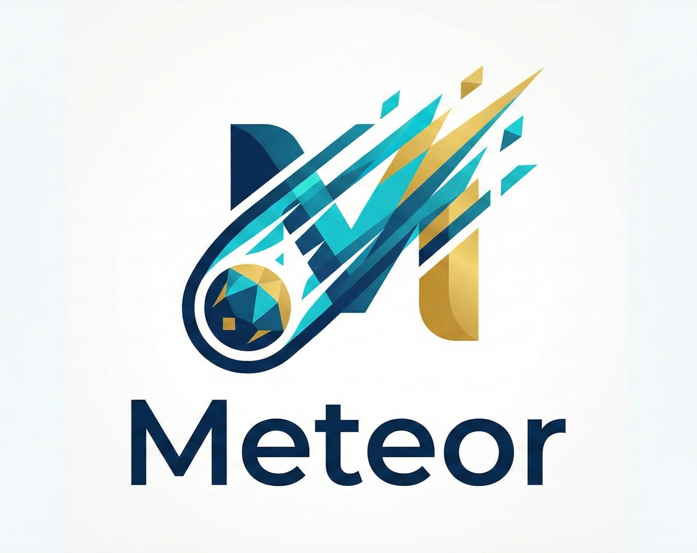

<p align="center">
  
  <br>
  <b style="font-size: 32px;">Meteor</b>
  <br>
  <i>兼具 Python 的优雅与 C++ 的性能</i>
  <br>
</p>

<p align="center">
  <a href="https://opensource.org/licenses/MIT">
    
  </a>
  <a href="#">
    
  </a>
  <a href="#">
    
  </a>
</p>

---

**Meteor** 是一门现代化的静态类型编程语言，底层基于 **LLVM** 构建，旨在融合 Python 的极简语法与 C/C++ 的原生性能。它专为这一代的硬件架构设计，内置了任意精度算术、无 GC 暂停的内存管理以及轻量级并发模型。

## 🌟 核心特性全览

### 1. 强大的类型系统 (Type System)

Meteor 拥有丰富且灵活的类型系统，既支持底层系统编程，也能胜任高层业务逻辑。

*   **基础类型**:
    *   `int`, `int8` ~ `int64`, `uint`, `uint8` ~ `uint64`: 全面的整数类型支持。
    *   `float`, `double`: IEEE 754 浮点数。
    *   `bool`: 布尔类型 (`true`, `false`)。
    *   `str`: 字符串类型。
*   **高级数值类型 (核心亮点)**:
    *   **`bigint`**: 内置支持任意精度整数，突破 64 位限制，适合加密算法与大数运算。
    *   **`decimal`**: 原生高精度定点小数，彻底解决浮点数精度丢失问题，金融计算首选。
    *   **`number`**: 智能联合数值类型，可在运行时自动分发不同的数值行为。
*   **动态特性**:
    *   **`dynamic`**: 类似 Python 的动态类型，支持运行时反射与类型转换，提供极致灵活性。
*   **集合与结构**:
    *   `list<T>`: 泛型动态数组。
    *   `tuple`: 不可变元组。
    *   `enum`: 枚举类型。
    *   `class`: 支持单继承的类与对象系统。

### 2. 无缝 C 语言交互 (C Interop)

Meteor 彻底打破了语言边界，支持直接导入 C 头文件，像调用原生函数一样调用 C 库。

*   **`import c`**: 直接解析 C 头文件，自动生成绑定。
*   **`@link`**: 指定需要链接的动态库/静态库。
*   **`@include`**: 指定头文件搜索路径。

### 3. 现代并发模型 (Concurrency)

Meteor 旨在简化并发编程，充分利用多核 CPU。

*   **`spawn`**: 关键字一键启动轻量级线程（基于系统线程池优化）。
*   **`join`**: 等待并发任务完成。
*   **`channel`** (实验性): 基于 CSP 模型的通信机制，用于线程间安全数据交换。

### 4. 系统级性能 (Performance)

*   **LLVM 后端**: 编译为高度优化的机器码，性能比肩 C/C++。
*   **AOT & JIT**:
    *   **JIT (即时编译)**: 开发阶段秒级反馈，像脚本语言一样直接运行。
    *   **AOT (提前编译)**: 生产环境编译为独立二进制文件，无依赖部署。
*   **内存管理 (ARC)**: 采用 **自动引用计数 (ARC)**，结合 `owned`、`weak` 和 `frozen` 关键字，提供确定性的内存释放，消除 GC 暂停（Stop-The-World）。

### 5. 完备的控制流 (Control Flow)

*   **循环与条件**: `if`, `else`, `while`, `for` 循环。
*   **模式匹配**: `switch`, `case`, `default`, 支持 `fallthrough`。
*   **资源管理**: `defer` 语句，确保函数退出前清理资源（如文件关闭、锁释放）。

### 6. 函数与模块 (Functions & Modules)

*   **函数一等公民**: 支持匿名函数（Lambda）、闭包。
*   **模块系统**:
    *   `import module` / `from module import ...`: 命名空间管理。
    *   `pub`: 控制符号可见性。

---

## ⚡ 性能基准 (Benchmark)

**测试场景**: 计算第 **10,000,000** 项斐波那契数（结果长达 **209 万位**），使用 Fast Doubling 算法。

| 语言 | 代码量 | 耗时 | 相对性能 |
|------|--------|------|----------|
| **Meteor** (native bigint) | **~40 lines** | **54.0s** | **1.00x** |
| C (GCC -O3, custom mp_int) | ~280 lines | 48.8s | 1.11x |
| Python 3.9 (native) | ~40 lines | > 500s | < 0.1x |

> Meteor 以 Python 级别的代码简洁度，实现了接近纯 C 语言手写优化的性能。

---

## 📖 代码示例

### 1. C 语言互操作 (Calling C)
无需编写任何 Wrapper 代码，直接调用 C 标准库或第三方库：
```python
@link("m")          # 链接 libm
@include("/usr/include") # 这通常是默认路径，此处仅作演示
import c "math.h"   # 导入头文件，符号自动进入 math 命名空间

# 直接调用 C 函数
result: float = math.cos(3.14159)
print(result)

# 使用 C 的结构体和指针
@link("curl")
import c "curl/curl.h"

curl: curl.CURL_ptr = curl.curl_easy_init()
if curl != null
    curl.curl_easy_setopt(curl, curl.CURLOPT_URL, "https://example.com")
    res: int = curl.curl_easy_perform(curl)
    curl.curl_easy_cleanup(curl)
```

### 2. 并发与大数计算
```python
# 计算任务：并行计算两个大数的阶乘
def factorial(n: int) -> bigint
    res: bigint = 1
    i: int = 1
    while i <= n
        res = res * i
        i = i + 1
    return res

print("Starting workers...")
# 启动两个并发任务
h1 = spawn factorial(50000)
h2 = spawn factorial(100000)

# 等待结果
res1: bigint = join h1
res2: bigint = join h2

print("Calculated " + str(res1.length()) + " digits and " + str(res2.length()) + " digits.")
```

### 3. 金融计算 (Decimal)
```python
# 传统的浮点数陷阱
f1: float = 0.1
f2: float = 0.2
print(f1 + f2 == 0.3)  # 输出: false (因为 0.30000000000000004)

# Meteor Decimal 的解决方案
d1: decimal = 0.1
d2: decimal = 0.2
print(d1 + d2 == 0.3)  # 输出: true (精确相等)

price: decimal = 19.99
qty: decimal = 3
total: decimal = price * qty
print(total)           # 输出: 59.97
```

### 4. 面向对象与继承
```python
class Shape
    area: float
    
    def __init__(self)
        self.area = 0.0

class Circle(Shape)
    radius: float

    def __init__(self, r: float)
        self.radius = r
        self.area = 3.14159 * r * r

c: Circle = Circle(10.0)
print(c.area)
```

---

## 🛠️ 安装与使用

### 环境依赖
*   Python 3.8+
*   LLVM 11.x (须包含 Clang)

### 快速开始
```bash
# 克隆仓库
git clone https://github.com/your-repo/meteor.git
cd meteor

# 安装依赖
pip install -r requirements.txt

# 运行代码 (JIT)
python src/meteor.py run examples/hello.met

# 编译代码 (AOT)
python src/meteor.py compile -o hello examples/hello.met
./hello
```

---

## 📄 许可证

MIT License
